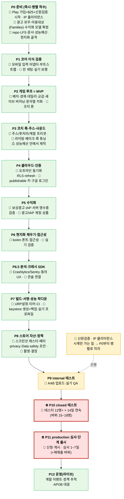

# 어린왕자의 작은 소행성(B-612) — 제작 로드맵 (처음 → Google Play 출시)

> Unity 6 LTS + URP · Supabase · 1인 개발 · 전부 개인 계정(kandanhan) · 기준일 2026-06-24
> 다중 에이전트 리서치 + 적대적 검증(28에이전트)으로 작성. 표기: **🤖 = AI가 코드/SQL/설정/문서로 자동** · **🙋 = 당신이 해야 하는 GUI/계정/실기/크리에이티브** · **⛔ = 코드로 단축 불가한 임계경로**.

---

## 0. 한눈 흐름도

**임계경로(달력 시간 지배)** = `P10 closed 14일 연속` + `P11 심사 최대 7일`(+재제출 버퍼). 코드로 못 줄이니 **일정 역산의 기준점**. 신원검증·IP 정리는 코딩과 무관하게 시계만 가므로 **P0에서 미리 시작**.

---

## 1. 검증된 2026 핵심 사실 (적대적 교차검증 완료)

| 사실 | 상태 | 실무 결론 |
|---|---|---|
| **Unity Personal 무료** (연 매출/펀딩 < **$200K**) | ✅ confirmed | 1인 프로젝트는 무료. $200K 초과 시 Pro 전환. 가격은 출시 시점 재확인 |
| **Runtime Fee 폐지**(2024-09-12, 설치당 과금 없음) | ✅ confirmed | 안심하고 AAB 빌드 |
| **Unity 6 Personal 스플래시 제거 가능** | ✅ confirmed | Player → Splash → Show Splash Screen 끄기 (Unity 6 빌드 한정) |
| **Play 등록비 1회 $25** | ✅ confirmed | 평생 1회, 연회비 없음 |
| **타깃 API: 지금 35, 2026-08-31부터 36(Android 16) 필수** | ✅ confirmed | **처음부터 targetSdk 36으로 빌드**(8월 후 출시 대비) |
| **closed 테스트 12명 × 14일 연속**(2023-11-13 이후 개인계정) | ✅ confirmed | 조직계정은 면제. 중도 이탈 대비 **15~18명 모집** |
| **Data safety 양식 + privacy policy URL 필수** | ✅ confirmed | 로그인/그림 저장 앱이므로 명백히 필수 |
| **Play Games(PGS)는 Supabase에 네이티브 로그인 미지원** | ✅ (직결 주장은 refuted) | 인증은 **Google Sign-In(Credential Manager→`signInWithIdToken`)**, PGS는 선택(클라우드세이브/업적, Edge Function 브리지) |
| 광고 미디에이션 | ✅ (보강) | AdMob/LevelPlay 유효, 시장 1위는 AppLovin MAX. **1인엔 AdMob이 가장 단순** |
| **Android 개발자 신원검증** 2026 롤아웃 | ⚠ med | 한국 적용 시점 불확실 → **선제 검증 권장** |
| 가챠/루트박스 | ✅ | 2026 PEGI 16 상향·확률공개 의무 → **전연령 코지엔 배제** |

---

## 2. 가장 먼저 못박을 결정 3가지 (P0 — 늦으면 후반 전체 재작업)

1. **⚖️ 어린왕자 IP 클리어런스 (최우선·출시 차단 리스크).** "Le Petit Prince/어린왕자/B-612/생텍쥐페리 삽화체·여우·장미 도상"은 국가별 저작권·상표 보호가 강하다(특히 프랑스). 그대로 쓰면 Play 침해 신고·takedown 위험. → **(a)** 출시국 권리상태 확인, **(b)** 위험하면 명칭·도상 **오리지널 재브랜딩**(별·여우·장미 '모티프'는 일반적이나 고유 이름/아트로 차별화), **(c)** 스토어 등록명·아이콘·스크린샷에서 침해소지 제거. *별·소행성·정원 가꾸기 컨셉은 유지하되 브랜드만 독자화하면 안전.*
2. **📣 광고 유무 + 아동대상(Families) 여부 + 수익화 모델.** 이 한 줄이 광고 SDK·분석 SDK·연령게이트·Data safety·코드 설계를 모두 좌우한다. 모델: **(A)** 무료+비침입 보상광고+코스메틱/광고제거 · **(B)** 저가 프리미엄 $3~5 무광고 · **(C)** 플랫폼 분리. 코지+아동매력 IP면 **(B) 또는 광고 없는 (A)**가 정책·심사가 가장 단순.
3. **🗓 신원검증·Play 계정.** 코딩과 무관하게 수일~수주 걸리니 **P0에 즉시 시작**.

---

## 3. 단계별 상세 (목표 · 🤖자동 · 🙋필수 · 완료기준)

### P0 — 준비·환경·결정 (병렬)
- **목표**: 모든 인프라를 개인 계정으로 정렬 + 위 3대 결정 확정 + 빌드 가능한 Unity 프로젝트.
- **🤖**: 새 repo `.gitignore`/`.gitattributes(LFS)`/`README`/`LICENSING`/`ATTRIBUTIONS` 정비, 기존 `unity/` 자재 이식 체크리스트, **성능 예산표**(폴리/드로콜/텍스처/후처리 목표)와 **현지화 골격**(키 기반 문자열 규칙) 선셋업, schema 검토, **비밀/키 백업 SOP** 문서.
- **🙋**: 개인 Unity ID로 **Personal 라이선스 + 최신 Unity 6 LTS(6000.x) 설치 후 버전 동결**, 개인 GitHub repo `Little-Prince-Unity` 생성, **Play Console 가입+$25+신원검증 착수**, **IP 클리어런스 결정**, **수익화/광고/아동대상 결정**, 개인 Supabase에 `schema.sql` Run + Exposed schemas `little_prince` + Auth(Email/Google) 켜기.
- **DoD**: B612Bootstrap ▶ 동작 + 개인 repo push + 개인 Supabase 로그인 성공 + 3대 결정 문서화.

### P1 — 코어 이식 검증
- **목표**: 검증 수치(반지름3·걷기0.9·회전1.8·카메라4.2/2.6/0.6)를 Unity에서 동일 게임필로 재현.
- **🤖**: 가상 조이스틱→`MoveInput/TurnInput` 입력 어댑터, invert 플래그 정리, 부트스트랩 테마 토글, **minSdk 후보 확정(예: 26/28)** + Vulkan 강제 시 구형기기 배제 트레이드오프 명시.
- **🙋**: 행성 Sphere(scale 6)·Planet 레이어·임시 모델, 실기 보행 감각.
- **DoD**: 실 안드로이드에서 손가락 보행 + 탭 배치 무끊김.

### P2 — 게임 루프 = MVP
- **목표**: 핵심 코지 루프(이동→배치→가시 변화→따뜻한 피드백) + 진행을 데이터까지.
- **🤖**: 장식 13+특별5·블록6 스폰, 코인경제(시작60/새별200/보상15)·happiness, 데일리 **soft-wall**(패널티/스트릭 없음), 여우 길들임 상태머신(MBTI 분기 재사용), 온보딩 '보이지 않는 튜토리얼', **세이브 `schema_version` + 마이그레이션 훅**, **모든 UI 문자열 키 기반화**(번역은 P6), 필요 컬럼 마이그레이션(RLS 포함).
- **🙋**: 코지 톤 가이드 1p(햅틱/BGM/팔레트), 사진 공유를 UGC로 둘지(IARC 영향) 결정.
- **DoD**: 신규 유저가 튜토리얼 없이 1분 내 첫 배치→happiness↑, 데일리 수령, 여우 1회 교감.
- **🪓 MVP 절단선**: *보행+배치+happiness+데일리+세이브+1테마* 까지가 출시 필수. (MBTI 동물분기·갤러리공유·계절 전체·사진모드 고급 = 출시 후)

### P3 — 코지 룩 · 게임필(주스) · 사운드  *(성능예산 먼저, 그 안에서 제작)*
- **목표**: '안전·풍요·부드러움'의 비주얼/오디오 + 차분한 피드백.
- **🤖**: PrimeTween 이징 유틸(제로 GC), 코지 주스 프리셋(EaseOutBack 팝+부드러운 입자+단음 SFX+soft 햅틱; `style_level`/`low_spec`로 자동 감쇠), URP 후처리 Volume 값(저강도 Kawase/Dual Bloom·warm 비네트·온화 컬러그레이딩), 계절 자동전환(영구 재획득=반-FOMO), CC0 임포트 파이프라인(glTFast/ASTC)+ATTRIBUTIONS 대장.
- **🙋**: 라이팅 베이크(Progressive GPU, 5~10texel)·블롭섀도·후처리 값 같은 **주관적 룩 튜닝**, **에셋 한 소스로 통일**(스타일 충돌 방지), Synty/Feel 등 유료 구매 판단, 음원 선곡.
- **DoD**: 노을 한 장면 "힐링" 느낌 + 실기 60fps(저사양 30) + 발열 안정.

### P4 — 클라우드 · 인증 (오프라인 우선)
- **🤖**: CloudSyncManager에 **LWW 동기화**(updated_at 기준; 코인/happiness는 additive 분리), 로컬캐시+pending 큐, refresh_token 자동갱신, 모든 테이블 `updated_at`+트리거+RLS, `DeletePainting` Storage object 삭제 보완, **순수 REST 유지**(IL2CPP 스트리핑 회피), **오프라인 시 기기시각 신뢰+복귀 시 서버 보정·역행 탐지**(데일리/계절 모순 해소).
- **🙋**: **publishable 키 발급**해 SupabaseConfig 교체(secret 키 절대 커밋 금지), 구글 로그인 = **Credential Manager(id_token→`signInWithIdToken`)** + Google Cloud OAuth client(Web+Android)·SHA-1·**OAuth 동의화면 프로덕션 게시**.
- **DoD**: 비행기모드 플레이→복귀 자동 동기화, 1h 후 재로그인 불필요, RLS로 타인 데이터 차단.

### P5 — 수익화 (P0 결정 따름)
- **🤖**: (광고 채택 시) AdMob 보상형 1플레이스먼트(테스트 ID), Unity IAP/Play Billing + **Edge Function 서버 영수증/엔타이틀먼트 검증**(클라 신뢰 최소화), MONETIZATION.md 정책(빈도 캡·가챠 금지·지역가격).
- **🙋**: 모델 최종 확정, AdMob/IAP 계정·실 광고 ID·상품·지역가격, 프로그램 약관 수락, 코스메틱 기획.
- **DoD**: 보상 시청→코인, 광고제거 구매→영속 엔타이틀먼트.

### P6 — 현지화 채우기 · 접근성
- **🤖**: Unity Localization(ko/en String Table, CJK 폴백), OFL 폰트 체인(Pretendard 본문/Noto Sans KR 폴백/Gowun 감성)+LICENSE 동봉, 접근성 옵션(글자크기·색약·햅틱·48dp·자막) 스펙.
- **🙋**: TMP Font Asset 생성, 실기 접근성(TalkBack·확대·색약·햅틱) 검증.
- **DoD**: ko/en 자동전환, 한글 글리프 누락 0, TalkBack로 핵심 버튼 읽힘.

### P6.5 — 분석 · 크래시 리포팅 *(internal 전에 필수)*
- **🤖**: Crashlytics/Sentry/Unity Cloud Diagnostics 중 1개 통합 + **동의 UX** + Data safety 반영(광고ID/식별자 미수집 설정), 핵심 로직(세이브 직렬화·LWW·경제) **EditMode 단위테스트 4~5개**.
- **🙋**: 콘솔 프로젝트 연결, 아동대상이면 식별자 수집 차단 확인.
- **DoD**: 강제 크래시가 콘솔에 보고됨 + 단위테스트 통과.

### P7 — 빌드 · 서명 · 성능 락다운
- **🤖**: Mobile URP Asset(HDR off·Depth/Opaque off·MSAA2x·SRP Batcher·Forward·shadow 20~40m·cascade1~2·soft off·Native RenderPass), targetFrameRate(60/저30)·품질 티어(render scale 0.8/0.9/1.0)·Adaptive Performance, GPU Resident Drawer 기본 OFF, CI 초안, `.gitignore`에 keystore.
- **🙋**: Player Settings(Target36/Min·Vulkan·AAB·IL2CPP·ARM64), **upload keystore 생성 + 오프사이트 2곳 백업**(분실=업데이트 영구불가), 스플래시 토글 후 **실기 육안 검증**, 최저사양 온디바이스 프로파일.
- **DoD**: 서명 AAB 실기 구동 + 최저사양 목표 fps/발열 OK.

### P8 — 스토어 자산 · 정책 제출물
- **🤖**: `marketing/` SVG→규격 PNG/JPEG 래스터화(아이콘512·피처1024×500·스크린샷), ko/en 메타데이터(제목≤30·짧은설명≤80·자세한≤4000), **개인정보처리방침 한/영 + 개인 Vercel 배포**, Data safety 14카테고리 매핑, IARC 답안 초안, **EULA·환불·문의 이메일**(한국 전자상거래법), 불필요 권한 제거.
- **🙋**: 스크린샷/영상 촬영·태블릿 샷, Families/광고 최종 반영.
- **DoD**: 전 자산 규격 통과 + privacy URL 공개 접근 + Data safety/IARC 확정.

### P9 — internal 테스트
- **🤖**: 빌드 체크리스트·릴리스노트·QA 시나리오(로그인/오프라인/구매/광고/데일리).
- **🙋**: (신원검증 완료 전제) AAB 업로드·internal 테스터 추가·실기 무크래시 확인.
- **DoD**: internal 빌드 핵심 루프 무크래시.

### P10 — ⛔ closed 테스트 (12명 × 14일 연속)
- **🤖**: 테스터 안내문·피드백 양식·14일 추적 시트.
- **🙋**: **테스터 15~18명 모집**(가족/지인/커뮤니티)·실제 설치·14일 연속 opt-in 유지·착수 직전 Play 최신 요건 재확인.
- **DoD**: 12명 14일 연속 충족 → production access 신청 가능.

### P11 — ⛔ production 심사 · 단계적 출시
- **🤖**: 최종 제출 체크리스트, staged rollout 런북(낮은 %→수동 증가·halt 기준).
- **🙋**: production access 신청·심사 대응(거절 1위=privacy/Data safety 불일치)·게시·**최초부터 단계적 출시 비율 수동 증가**.
- **DoD**: Play에서 일반 사용자 설치 가능.

### P12 — 운영 (라이브)
- **🤖**: 업데이트 빌드/노트, 계절 이벤트 데이터, API36(2026-08-31)·향후 37 추적, $200K 근접 시 Pro 전환 리마인더.
- **🙋**: 매출 추적·신규 약관 수락·계절 아트.

---

## 4. 🤖 vs 🙋 한 장 요약

| Phase | 🤖 AI가 자동 | 🙋 당신 최소 작업 |
|---|---|---|
| P0 | repo/문서/성능예산/현지화골격/키백업 SOP/schema 검토 | Unity·repo·Play$25·신원검증·**IP/모델/아동 결정**·schema Run |
| P1 | 입력 어댑터·부트스트랩·minSdk 확정 | 씬 배치·실기 보행 |
| P2 | 루프·경제·데일리·교감·세이브버저닝·문자열 키화 | 코지 톤·UGC 여부 |
| P3 | 주스/후처리/계절 프리셋·CC0 파이프라인 | 라이팅 베이크·룩 튜닝·에셋 통일·유료 구매 |
| P4 | 오프라인 LWW·RLS·refresh·시각 보정 | publishable 키·구글 로그인·OAuth 게시 |
| P5 | AdMob/IAP/서버검증·정책 문서 | 모델·광고/IAP 계정·상품·가격 |
| P6 | Localization·폰트·접근성 스펙 | TMP 폰트·실기 접근성 |
| P6.5 | 크래시 SDK·동의 UX·단위테스트 | 콘솔 연결 |
| P7 | URP 설정·티어·CI | Player Settings·**keystore 생성+백업**·실기 프로파일 |
| P8 | 자산 래스터·메타·privacy 배포·Data safety/IARC 초안 | 촬영·영상·결정 |
| P9 | 체크리스트·QA | **$25·신원검증·AAB 업로드** |
| P10 | 테스터 안내·추적 | **테스터 12+명 모집·14일 유지** |
| P11 | 제출 체크리스트·롤아웃 런북 | production 신청·게시·롤아웃 |
| P12 | 업데이트·이벤트·정책 추적 | 매출·약관·아트 |

---

## 5. 매력/게임필(juice) 아이디어 — 코지 = '차분한 주스'

| # | 아이디어 | 한 줄 | 난이도 |
|---|---|---|---|
| 1 | 배치 팝 | 놓으면 EaseOutBack 0→1.1→1.0 + 단음 + 꽃잎 1버스트 | 하 |
| 2 | 발걸음 호흡 | bob을 이징으로 다듬어 잔잔한 상하 호흡 | 하 |
| 3 | 여우 길들임 미터 | 매일 다가가면 거리↓, 친구되면 먼저 다가옴 | 중 |
| 4 | soft-wall 데일리 마무리 | 하루치 소진 시 "오늘은 충분히 돌봤어요"·패널티 없음 | 중 |
| 5 | 노을 사진모드 | 프레임·3분할·Hide UI → 갤러리 저장 | 중 |
| 6 | 계절 시계 연동 | 실시간 테마 조명·스카이틴트·앰비언스 전환 | 중 |
| 7 | 쓰다듬기 햅틱 | 동물 터치 시 하트 입자+soft 햅틱+작은 소리 | 하 |
| 8 | 적응형 앰비언스 | 낮/밤·날씨로 BGM/환경음 부드럽게 크로스페이드 | 중 |
| 9 | 오브젝트 서사 힌트 | "노을을 마흔네 번…" 같은 hint를 배치 시 노출 | 하 |
| 10 | happiness 비주얼 보상 | 행복↑ 시 들꽃·반딧불이 미세 증가 | 중 |
| 11 | 누적 선물 캐치업 | 며칠 비워도 처벌 대신 "돌아와서 반가워요" 선물 | 하 |
| 12 | 성격 닮은 동물 | 내 성격(ei/sn/tf/jp)에 동물 반응/대사 분기 | 중 |
| 13 | 물주기 의식 | 물방울 입자+잎 살랑+단음 → 다음날 성장 | 중 |
| 14 | 미세 카메라 push | 화면흔들림 대신 0.5°/2% 줌-인의 잔잔한 강조 | 하 |
| 15 | 별 사이 여행 트랜지션 | 별이 흐르는 페이드 + 음악 모먼트 | 중 |
| 16 | 저녁 등불 점등 | 밤이면 창에 따뜻한 발광 순차 점등 | 중 |
| 17 | 보이지 않는 온보딩 | 모달 없이 1분 내 quick-win으로 루프 체득 | 중 |
| 18 | 그림 갤러리 | 찍은/그린 그림을 클라우드 갤러리로 모아 애착↑ | 중 |

> 원칙: **폭발적 스크린셰이크·강한 럼블 금지.** 모든 강도는 `style_level`/`low_spec`로 자동 감쇠.

---

## 6. 자료 shortlist (무료·상업 사용 가능 우선, 검증 링크)

**3D 에셋** — 한 소스로 통일 권장
- Kenney (CC0, 무귀속·최안전) https://kenney.nl · Quaternius (CC0) https://quaternius.com · Poly Pizza (모델별 CC0/CC-BY) https://poly.pizza
- (유료) Synty 통일 코지룩 https://syntystore.com · Sketchfab CC 모델은 **2025 일몰 전 백업** https://sketchfab.com
- AI 3D(보조): Meshy(무료=CC-BY 귀속), Rodin/Hyper3D, Tripo, Luma — **토폴로지/UV 정리·귀속 추적 비용 유의**

**폰트 (전부 OFL·임베드 가능)** — Pretendard https://github.com/orioncactus/pretendard · Noto Sans KR https://fonts.google.com/noto/specimen/Noto+Sans+KR · Gowun Dodum https://github.com/yangheeryu/Gowun-Dodum · 한글 무료 모음 https://noonnu.cc

**오디오 (위험 낮은 순)** — Kenney Audio(CC0) https://kenney.nl/assets/category:Audio · Pixabay(무표기) https://pixabay.com/sound-effects/ · Freesound(CC0 안전·CC-BY 표기·NC 금지) https://freesound.org · incompetech/Kevin MacLeod(CC BY) https://incompetech.com/music/royalty-free/music.html

**미들웨어/툴** — PrimeTween(무료·제로할당) https://github.com/KirillKuzyk/PrimeTween · Unity Photo Mode(오픈소스) https://github.com/UnityTechnologies/PhotoMode · (선택) Feel/Nice Vibrations 햅틱 https://feel.moremountains.com · FMOD Indie(예산 한도·등록 필요; **Unity 내장 오디오로도 대체 가능**) https://www.fmod.com/licensing · 무료 MIT VFX: stylized-vegetation, Unity-GrassAndFur

**광고/결제/인증** — AdMob Unity Plugin https://developers.google.com/admob/unity/quick-start · LevelPlay https://unity.com/products/levelplay · google-signin-unity https://github.com/googlesamples/google-signin-unity · supabase-csharp(Unity) https://github.com/supabase-community/supabase-csharp/wiki/Unity · play-games-plugin-for-unity https://github.com/playgameservices/play-games-plugin-for-unity

**공식 문서(핵심)** — 타깃 API https://developer.android.com/google/play/requirements/target-sdk · Data safety https://support.google.com/googleplay/android-developer/answer/10787469 · URP 모바일 최적화 https://developer.android.com/develop/xr/unity/performance/urp-asset-settings · Unity 모바일 라이팅 https://developer.android.com/games/optimize/lighting-for-mobile-games-with-unity · PGS server access https://developer.android.com/games/pgs/android/server-access

---

## 7. 위험 & 대비

| 위험 | 대비책 |
|---|---|
| **어린왕자 IP 침해(출시 차단)** | P0에서 국가별 권리 확인·필요시 오리지널 재브랜딩 |
| **closed 14일 + 심사 + 재제출** | 임계경로 기준으로 일정 역산·이 기간에 폴리시 병행 |
| **2026-08-31 targetSdk 36** | 처음부터 36으로 빌드 |
| **PGS id_token 미노출** | Credential Manager 경로 채택, PGS는 선택 |
| **신원검증 지연** | P0부터 선제 착수(시계만 가는 일) |
| **keystore 분실 = 업데이트 영구불가** | 오프사이트 2곳 백업 SOP |
| **세이브 스키마 변경 호환성** | `schema_version`+마이그레이션 훅을 초기부터 |
| **범위 폭주(1인 6~12개월)** | MVP 절단선 엄수·나머지는 출시 후 |
| **에셋 스타일 충돌** | 한 소스 통일 또는 통일 셰이더/팔레트 |
| **저사양 발열/저하** | Forward·베이크드 라이팅·Adaptive Performance·최저사양 프로파일 |
| **privacy/Data safety 불일치(거절 1위)** | claude가 사전 배포·매핑표로 정합 |
| **CC-BY/AI 무료 귀속 누락** | ATTRIBUTIONS.md + 인게임 Credits, NC 입수 배제 |
| **secret 키/회사 Supabase 오연결** | publishable 키만 클라, 마이그레이션 전 연결 org 확인 |

---

*근거: 28-에이전트 리서치(Unity·Android·Supabase·코지 디자인·수익화·현지화) + 8개 핵심 사실 적대적 검증. 정책/가격은 변동 가능하니 P0와 출시 직전에 공식 페이지로 재확인.*
